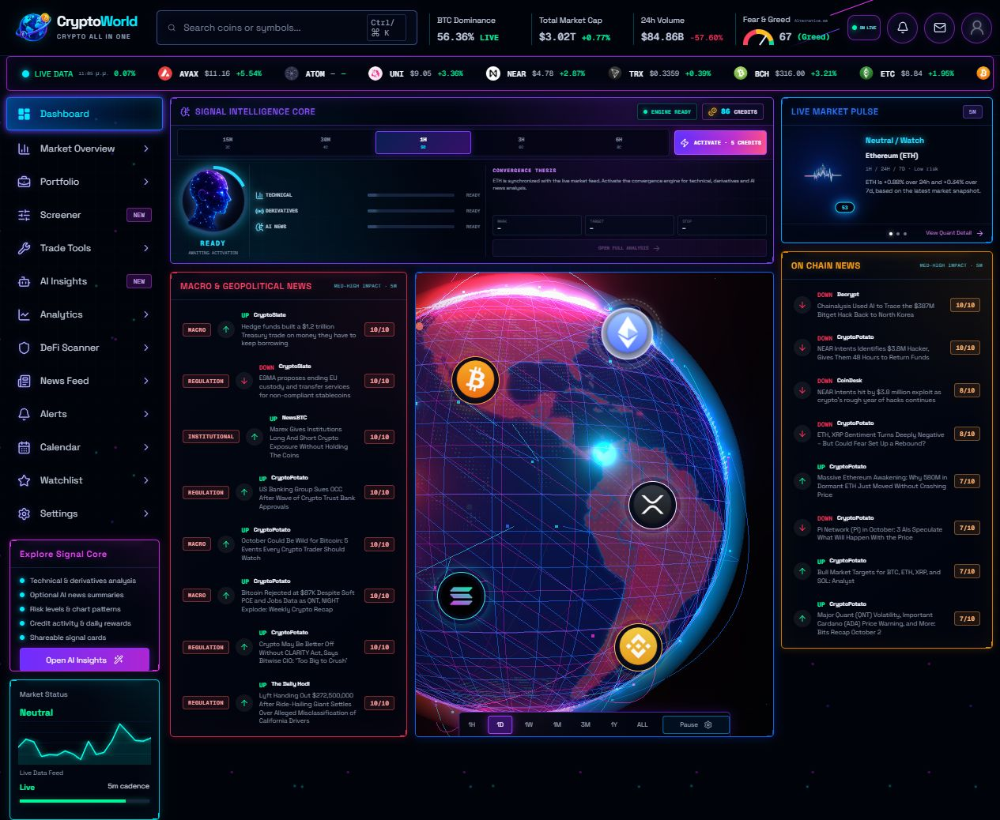
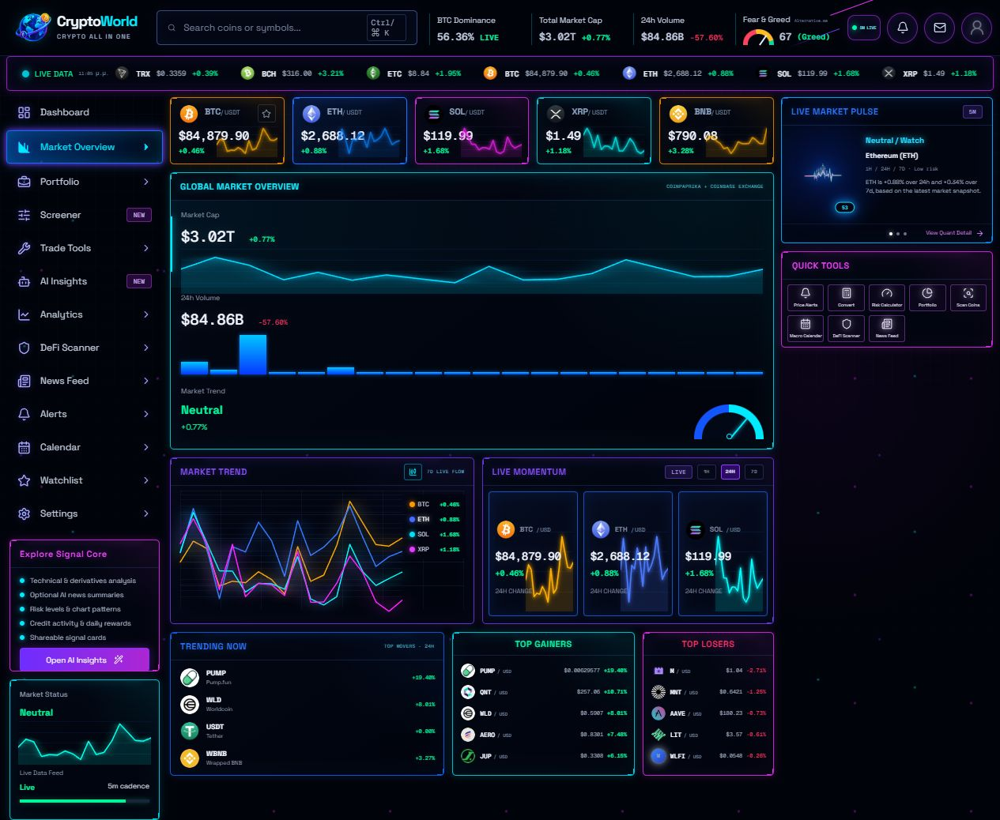
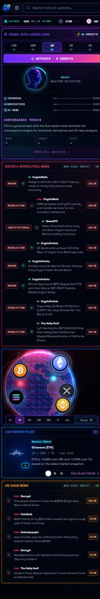

<p align="center">
  
</p>

# CryptoWorld

[](https://github.com/ManosTsagkos/CryptoWorld/actions/workflows/quality.yml)

Crypto all in one: a dashboard with live market data, interactive charts and a signal-analysis engine. It brings prices, technical indicators, derivatives data, DeFi and news into one workspace. AI news summaries are optional; the app runs without API keys or paid services.

[Portfolio preview](https://manostsagkos.github.io/CryptoWorld/) · [Screenshots](#screenshots) · [Run interactive demo](https://codespaces.new/ManosTsagkos/CryptoWorld) · [Download source](https://github.com/ManosTsagkos/CryptoWorld/releases/latest) · [Architecture](docs/architecture.md)

The **[public portfolio preview](https://manostsagkos.github.io/CryptoWorld/)** opens without installation or a GitHub account. It presents real app screenshots, the architecture and demo instructions. It is a static showcase, not a hosted version of the live dashboard; use Codespaces or a local clone for the full interactive app.

## Screenshots



Captured from the running app, not mockups. Prices and headlines change with the feeds. Click an image to view it at full size.

<table>
  <tr>
    <th>Market Overview</th>
    <th>Mobile</th>
  </tr>
  <tr>
    <td width="75%"><a href="docs/screenshots/market-overview.jpg"></a></td>
    <td width="25%"><a href="docs/screenshots/mobile.jpg"></a></td>
  </tr>
</table>

## Run locally

To try the full app in your browser, [open it in GitHub Codespaces](https://codespaces.new/ManosTsagkos/CryptoWorld). The dev container installs dependencies and migrates a private local demo database. Run `npm run dev -- --host 0.0.0.0 --port 5173` and open the forwarded **CryptoWorld demo** port. Codespaces requires a GitHub account and uses the reviewer's own quota; it is not a permanently hosted public demo. Keep the port private and stop the codespace when finished. See [GitHub's port-forwarding guide](https://docs.github.com/en/codespaces/developing-in-a-codespace/forwarding-ports-in-your-codespace) if needed.

To run on your computer, use Node.js **22.13 or newer**:

```bash
git clone https://github.com/ManosTsagkos/CryptoWorld.git
cd CryptoWorld
npm ci
npm run db:migrate:local
npm run dev
```

Open the URL printed in the terminal. An internet connection is needed for market data and news, but no exchange account or Cloudflare account is needed for local development.

For a quick look around, follow the [demo walkthrough](docs/portfolio.md). It covers the globe, charts, watchlist and no-key signal analysis in a few minutes.

## Portfolio website

The GitHub Pages showcase is built from `docs/showcase/` with `npm run build:portfolio`. The build copies only its HTML, stylesheet, script, logo and three screenshots into `dist/portfolio`; it never deploys Worker code, databases, environment files or the full application build. The Pages workflow runs the complete quality check before publishing. See [publishing](docs/publishing.md) for the setup.

## What's in the app

- Live prices, market movers, volume, dominance and Fear & Greed data.
- Coin and timeframe selection, interactive price charts and a draggable, rotating 3D globe.
- EMA, RSI, MACD, Bollinger Bands, ATR, volume and rule-based chart-pattern analysis.
- Funding, open interest and long/short data when the exchange provides them.
- A credit wallet, saved analyses, shareable summaries and candle-based signal tracking.
- Watchlists, browser-local price alerts, DeFi protocols and RSS news feeds.
- Responsive navigation, keyboard-accessible dialogs and reduced-motion settings.

The signal engine returns a LONG, SHORT or NEUTRAL bias with its inputs, risk levels and source availability. Without AI credentials, it uses deterministic technical analysis and labels that mode in the UI. This is an educational project, **not financial advice or an automated trading system**.

## How it's built

The frontend uses React 19, TypeScript and Vinext/Vite. Three.js handles the globe; Lightweight Charts handles price history. A Cloudflare Worker normalizes upstream responses, calculates signals and persists credits, analyses and cache entries in D1 through Drizzle ORM.

Market data comes from public providers including CoinGecko, CoinPaprika, Coinbase, DefiLlama, Binance, Bybit and Alternative.me. The app polls on a five-minute cadence. The Worker also caches suitable responses for five minutes, retries selected temporary failures and uses backup providers. Source labels distinguish live, stale and unavailable data.

Market and analysis requests use same-origin API endpoints. Coin icons and fonts may load from external hosts. Credentials stay in the Worker environment.

Useful places to start reading the code:

- [`app/page.tsx`](app/page.tsx) — dashboard and feature views.
- [`app/components/`](app/components/) — price chart and globe.
- [`app/use-preferences.ts`](app/use-preferences.ts) and [`app/browser-store.ts`](app/browser-store.ts) — browser preferences and cross-tab synchronization.
- [`worker/index.ts`](worker/index.ts) — API routes and provider adapters.
- [`worker/signal-core.ts`](worker/signal-core.ts) — candle validation, aggregation and signal-resolution helpers.
- [`worker/feed-parser.ts`](worker/feed-parser.ts) — shared RSS/Atom parsing.
- [`db/schema.ts`](db/schema.ts) and [`drizzle/`](drizzle/) — database schema and migrations.

The [architecture notes](docs/architecture.md) cover the data flow and trust boundaries. `/api/data-health` shows D1 reachability and provider fallback counters for the current Worker isolate.

## Optional AI configuration

Copy `.dev.vars.example` to `.dev.vars` and add a key for Groq, Gemini, OpenRouter or Cerebras. The example lists the supported variables, including the optional OpenRouter model override. One configured provider is enough to enable model-generated news interpretation.

Keep real keys in the ignored `.dev.vars` file or deployment secrets. Build and test configuration excludes local AI keys from generated output.

`wrangler.jsonc` contains a placeholder database ID that works with the local simulator. A hosted deployment needs its own D1 binding and migrations. The optional Sites file `.openai/hosting.json` is private; `.openai/hosting.example.json` is the safe template. Neither file is needed to run a GitHub clone locally.

## Checks

```bash
npm run check
```

This runs the secret-pattern scan, formatting check, ESLint, TypeScript, unit tests, a production build and runtime tests. GitHub Actions runs the same command on pushes and pull requests. Use `npm run format` to apply the project's formatting rules after editing.

The tests cover candle normalization, complete three-hour aggregation, RSI, risk gates, conservative signal outcomes, browser settings and cross-tab storage, chart sampling, RSS/Atom parsing and Unicode sharing. They also apply the migrations to a fresh SQLite database and check them against the schema.

Runtime tests start the app with an isolated local D1 database and no AI credentials. They check rendering, wallet isolation, concurrent daily grants, request validation, origin checks and escaped share pages. The generated build is checked for secret files and credential-shaped client values. Automated tests do not rely on upstream APIs or make paid AI calls.

Individual commands are available as `npm run lint`, `npm run typecheck`, `npm run test:unit` and `npm run test:smoke`. If setup fails, see [troubleshooting](docs/troubleshooting.md) and [API errors](docs/api-errors.md).

## Demo boundaries

The portfolio uses fixed example holdings valued at live prices, not a connected exchange account. Credits and daily rewards demonstrate a product flow; there is no payment or subscription processing. Visitor IDs are browser-generated, not authenticated accounts, so this wallet is not suitable for paid balances.

Price alerts run while the app tab is open. The macro calendar uses the published Federal Reserve meeting schedule, not a live economic-calendar feed. Public APIs may be unavailable or rate-limited.

Signal outcomes are graded from complete minute candles, not executed trades. Missing coverage keeps a result pending; a candle touching both stop and target is conservatively counted as a stop. Resolution happens during API activity rather than a scheduled background job. Confidence and recorded outcomes are not guarantees of trading performance.

The next priorities are authenticated accounts, scheduled resolution, background alerts and splitting the larger UI and Worker modules into smaller features.

## Security and publishing

Local credentials, databases, build output and personal hosting configuration are excluded from the public file set. Public source code is still visible by design. See [SECURITY.md](SECURITY.md), [CONTRIBUTING.md](CONTRIBUTING.md) and the [GitHub publication checklist](docs/publishing.md).

As of 3 October 2026, the full dependency audit reports an unpatched development/build-tool advisory; the production-only audit reports none. The [dependency review](docs/dependency-security.md) records the affected package, exposure and reproduction commands.

No open-source license has been selected. The source is provided for portfolio review.
