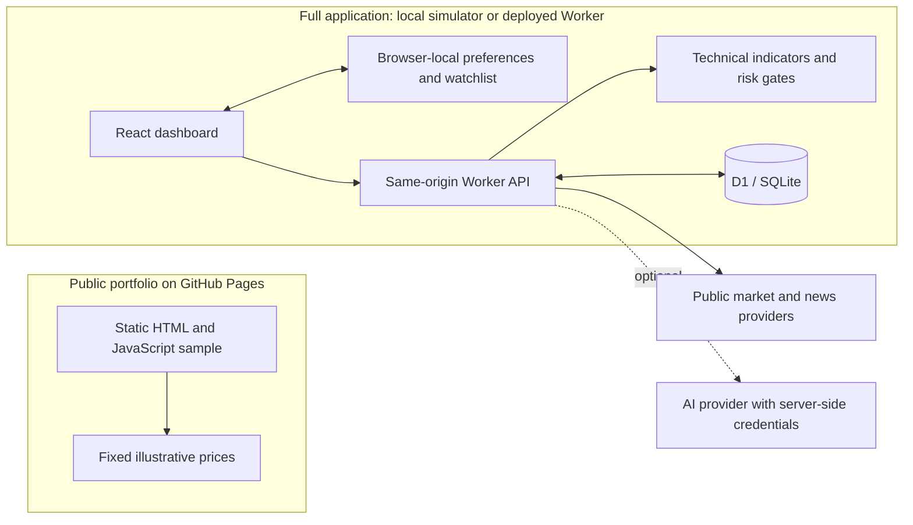

# Architecture

## System overview

CryptoWorld is a React application served through a Cloudflare Worker. The Worker owns third-party requests, normalization, caching, signal calculations and database access so API credentials and provider-specific response formats do not leak into the browser.



The Pages sample has no connection to the Worker or third-party providers. Its watchlist is stored separately from the full app's watchlist. The full application needs internet access for public feeds; model-generated news interpretation additionally needs a configured AI provider key.

## Main components

### React dashboard

- `app/page.tsx` contains the main dashboard and feature views.
- `app/components/MarketChart.tsx` renders market history.
- `app/components/ThreeGlobe.tsx` renders and animates the interactive globe.
- `app/components/chart-series.ts` prepares sampled price/volume series using their timestamps.
- `app/use-preferences.ts` and `app/browser-store.ts` share browser settings and synchronize them across tabs.
- `app/market-data.ts` and `app/signal-analysis.ts` define shared API contracts.

Browser-local storage is used for watchlists, price alerts, preferences and anonymous visitor identification. These features are device-specific. Client-supplied identity/email headers are not authentication and do not select private wallets.

`worker/feed-parser.ts` handles shared RSS/Atom parsing and article-link validation; `worker/signal-core.ts` contains the pure candle and resolution helpers.

### Worker API

`worker/index.ts` is the server entry point. It provides:

- timeout and retry handling;
- data-provider fallback chains;
- five-minute market caching;
- technical and derivatives calculations;
- optional AI-provider fallback;
- credit debit/refund behavior;
- D1 persistence and data-health diagnostics;
- server-rendered application fallback through Vinext.

### Database

Cloudflare D1 stores four logical areas:

| Table                | Purpose                                              |
| -------------------- | ---------------------------------------------------- |
| `credit_accounts`    | Credit balance, spend totals and daily streak state. |
| `signal_analyses`    | Analysis history and later outcome resolution.       |
| `signal_rate_limits` | Cross-isolate analysis throttling.                   |
| `kv_cache`           | Shared JSON cache with expiry timestamps.            |

Drizzle schema definitions live in `db/schema.ts`; ordered SQL migrations live in `drizzle/`.

The existing Worker and D1 resource names remain `top-crypto-signals` and `top-crypto-signals-db`. They are deployment identifiers, not the product name; retaining them avoids changing an existing database when updating the CryptoWorld branding.

## Market-data flow

```text
Dashboard
  → GET /api/market-data
  → Worker cache
  → CoinGecko primary request
  → CoinPaprika / Coinbase / DefiLlama fallback where applicable
  → normalize response
  → D1 + in-memory cache
  → browser rendering
```

Historical series similarly fall back between CoinGecko, Coinbase and DefiLlama. The returned payload identifies its source and whether cached stale data was required.

## Signal-analysis flow

```text
POST /api/signal-analysis
  → validate origin, symbol and timeframe
  → enforce a 16 KiB request-body limit
  → enforce rate limit
  → debit credits atomically
  → load candles, ticker, volume and derivatives inputs
  → calculate technical indicators, market regime and risk gates
  → collect relevant RSS headlines
  → optional AI interpretation / deterministic fallback
  → persist analysis
  → return response
  → refund credits if the analysis fails
```

Resolved results are aggregated into the public track-record and confidence-calibration endpoints. Resolution currently occurs opportunistically when relevant API requests are made.

Grading starts when the analysis is saved for the current request, even if some inputs were cached. It uses a contiguous sequence of complete 1-minute candles within the stated horizon; partial entry/deadline minutes are excluded. Missing coverage leaves the result pending. If one candle touches both stop and target, the outcome is conservatively recorded as a stop because OHLC does not reveal touch order. These are educational candle-based outcomes, not executed trades, tick-level backtests or P&L.

## Failure boundaries

- Provider-specific failures are contained in their adapter/fallback path.
- API endpoints return safe user-facing messages rather than upstream response bodies.
- Missing D1 falls back to per-isolate memory for development, with a visible warning and health status.
- Missing AI credentials uses deterministic analysis instead of preventing the dashboard from running.

## Trust boundaries

- Provider credentials are Worker-only secrets.
- Anonymous visitor IDs are client generated and should not be considered authentication.
- A deployment must add a verified account/authentication boundary before using wallets for paid balances or private personal data.
- Shared-signal payloads are validated and escaped before HTML rendering.
